## Projet d’intelligence artificielle Finance
## Sujet 16 : Coloration de graphe et de carte (Graph/Map Coloring)

## Contexte théorique : 
Le projet traite le problème de coloration de graphe : on cherche à attribuer une couleur à chaque nœud d’un graphe de manière à ce que deux nœuds reliés par une arête n’aient jamais la même couleur. 
Ce type de modèle s’applique directement à la coloration de cartes : chaque région est un nœud, et une arête relie deux régions si elles sont voisines. Le but peut être soit de respecter un nombre de couleurs fixé kk (on veut savoir si le graphe est k-coloriable), soit de trouver le nombre minimal de couleurs nécessaire, appelé nombre chromatique et noté k*.
Dans le cadre de la programmation par contraintes (CSP), la formulation est très naturelle : on associe à chaque nœud v une variable c(v) représentant sa couleur, avec un domaine de valeurs possibles (par exemple {0,…,k−1}). La contrainte principale est imposée pour chaque arête (u,v) : c(u)≠c(v)
Ce sont donc essentiellement des contraintes binaires répétées sur toutes les arêtes, et l’algorithme de résolution cherche une affectation de valeurs qui respecte toutes les contraintes.
Ce problème est connu pour être difficile en général (NP-difficile) lorsqu’on cherche le minimum k*. En pratique, cela signifie que certains graphes peuvent devenir rapidement coûteux à résoudre quand leur taille augmente ou quand ils sont denses. C’est pour cette raison qu’on combine souvent deux types d’approches : des heuristiques (très rapides, mais pas garanties optimales) et des méthodes exactes (qui peuvent certifier l’optimalité, mais au prix d’un temps de calcul plus élevé). À noter que dans le cas particulier des cartes planaires, le théorème des quatre couleurs montre qu’on n’a jamais besoin de plus de 4 couleurs pour colorier une carte.

## 1) Approches implémentées
## 1.1. Heuristiques
Pour résoudre la coloration rapidement, nous avons implémenté deux heuristiques. L’idée est d’obtenir une solution valide en quelques millisecondes, même si elle n’est pas toujours optimale. Ces méthodes sont particulièrement utiles pour :
-Obtenir une solution “tout de suite” pour visualiser le graphe colorié
-Fournir une borne supérieure (un nombre de couleurs réalisable) qui aide ensuite la méthode exacte à aller plus vite.

Greedy (glouton) : 
L’heuristique greedy assigne les couleurs dans un ordre donné : pour chaque nœud, elle choisit la plus petite couleur disponible qui ne viole pas la contrainte avec ses voisins déjà coloriés. Cette approche est extrêmement simple et très rapide, mais elle dépend fortement de l’ordre des nœuds : selon l’ordre, elle peut utiliser plus de couleurs que nécessaire. 
Dans notre projet, greedy sert surtout de baseline et permet d’obtenir immédiatement une solution valide sur toutes les instances testées.

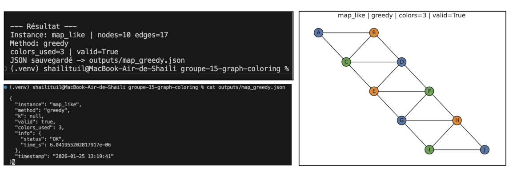

L’exécution montre que l’heuristique Greedy fonctionne correctement sur l’instance map_like. Le programme trouve une coloration valide (valid=True) en 3 couleurs, génère la visualisation correspondante et exporte le résultat en JSON, ce qui confirme à la fois la robustesse de la méthode et le bon fonctionnement des sorties du logiciel.

DSATUR (Degree of Saturation) : 
DSATUR est une heuristique plus “intelligente” que greedy. Au lieu de parcourir les nœuds dans un ordre fixe, DSATUR choisit à chaque étape le nœud le plus “contraint”, c’est-à-dire celui qui a déjà autour de lui le plus grand nombre de couleurs différentes (degré de saturation). En cas d’égalité, on départage généralement par le degré du nœud (nombre de voisins). Ensuite, comme pour greedy, on assigne la plus petite couleur disponible. Cette stratégie tend à réduire le nombre de couleurs utilisées, en particulier sur les graphes denses ou aléatoires, tout en restant très rapide.
Dans notre implémentation, DSATUR est utilisé à la fois comme méthode de résolution autonome et comme outil d’optimisation : il fournit souvent une bonne borne supérieure (UB) pour le nombre minimal de couleurs, ce qui permet de limiter la recherche de la méthode exacte (CP-SAT) à un intervalle beaucoup plus petit.

Cette figure montre que l’heuristique DSATUR produit bien une solution correcte : valid=True confirme que tous les voisins ont des couleurs différentes. Sur map_like, DSATUR utilise 3 couleurs et génère à la fois une visualisation et un fichier JSON contenant la solution et les informations d’exécution.

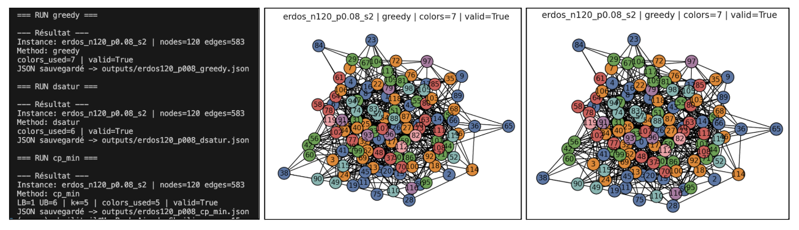

À paramètres constants (même graphe généré par n, p et seed), on observe que DSATUR obtient une meilleure solution que Greedy (moins de couleurs : 6 contre 7), tout en restant très rapide. La méthode cp_min va plus loin en recherchant le minimum k* et trouve ici une solution optimale à 5 couleurs, au prix d’un effort de calcul plus important. Cette comparaison illustre clairement le compromis : heuristiques rapides mais non garanties optimales, contre méthode exacte plus coûteuse mais certifiée.

## 1.2. Programmation par contraintes 

cp_k (CP-SAT avec k fixé) : 
La méthode cp_k résout la version “décision” du problème : au lieu de chercher le minimum, on se demande simplement si le graphe est coloriable avec un nombre de couleurs fixé k. Concrètement, on crée une variable “couleur” pour chaque nœud, avec un domaine {0,…,k−1}, puis on impose pour chaque arête (u,v) la contrainte c(u)=c(v). 
Le solveur OR-Tools (CP-SAT) explore alors l’espace de recherche et renvoie un statut : FAISABLE/OPTIMAL si une solution existe, ou IMPOSSIBLE si aucune coloration avec k couleurs n’est possible. 
Cette approche est utile car elle permet de tester rapidement un seuil (ex. “2 couleurs suffisent-elles ?”) et elle sert de base pour comprendre la difficulté du problème sur différentes instances.

Cette exécution illustre la version “décision” du problème : on fixe k et on demande si une coloration existe. Pour le triangle, k=2 est insuffisant, le solveur retourne donc INFEASIBLE et valid=False. Cela confirme que le programme détecte correctement les cas où la contrainte c(u)=c(v) ne peut pas être satisfaite.

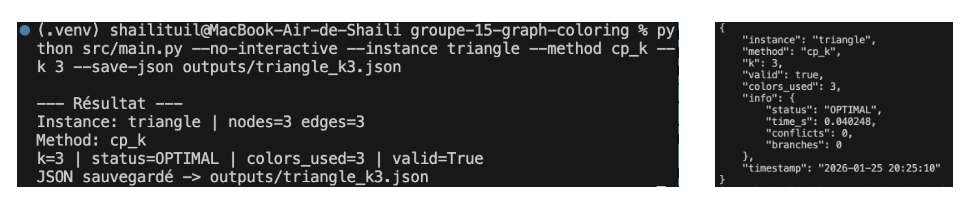

En augmentant à k=3, le solveur trouve une solution et valide la coloration (valid=True). Le statut OPTIMAL confirme qu’une affectation respectant toutes les contraintes a été obtenue dans le domaine {0,1,2}. Le résultat est également exporté au format JSON, ce qui prouve le bon fonctionnement des sorties du logiciel.

cp_min (CP-SAT : recherche du nombre minimal de couleurs)) : 
La méthode cp_min résout la version “optimisation” du problème : au lieu de tester un k fixé, elle cherche automatiquement le nombre minimal de couleurs nécessaire, noté k* (nombre chromatique). Le principe est de trouver le plus petit k pour lequel une coloration valide existe. Pour accélérer cette recherche, notre programme utilise des bornes :
Une borne inférieure (LB), basée sur une propriété simple du graphe, qui garantit que k*≥LB,
Une borne supérieure (UB) fournie par une heuristique (DSATUR), qui donne une solution valide donc k*≤UB.
Ensuite, cp_min ne teste que les valeurs de kk entre LB et UB (au lieu de 1 à n), ce qui rend la recherche plus rapide. Le solveur CP-SAT certifie le résultat : quand cp_min retourne k* et valid=True, cela signifie que le graphe est coloriable avec k* couleurs et qu’il est impossible de faire mieux.

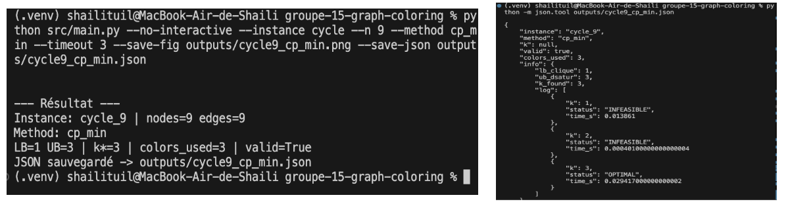

## 1.3. Programmation par contraintes 
En plus du choix des méthodes, nous avons travaillé sur l’efficacité et la stabilité du programme. Côté solveur, nous nous appuyons sur CP-SAT (OR-Tools), qui combine recherche et propagation de contraintes pour éliminer rapidement des affectations impossibles. Nous utilisons aussi des hints afin de guider le solveur vers de bonnes solutions plus vite, ainsi qu’un léger bris de symétrie pour réduire les cas équivalents. 
Enfin, nous avons ajouté des garde-fous côté logiciel (timeouts, exports, vérification valid=True) pour éviter les blocages et garantir des sorties exploitables. L’impact principal de ces optimisations est une réduction du temps de résolution et une exécution plus fiable sur des instances plus grandes ou plus denses.

## 2) Bonus réalisés et fonctionnalités avancées 
## 2.1 Bonus 1 : Mode “compare”
Le mode compare permet d’exécuter automatiquement plusieurs approches sur la même instance, puis de comparer leurs résultats de façon claire et reproductible. Concrètement, compare lance successivement Greedy, DSATUR et cp_min.
L’intérêt principal est double :
Comparer la qualité des solutions via le nombre de couleurs utilisées
Comparer les performances tout en gardant les mêmes paramètres d’instance (notamment pour erdos avec n, p, seed).
Ce mode est très utile pour le rapport et la présentation car il produit en une seule commande une comparaison cohérente, et permet de montrer le compromis classique : heuristiques rapides vs résolution optimale certifiée.

## 2.2 Bonus 2 : Mode “benchmark”
Ce mode permet de tester automatiquement les différentes méthodes sur un ensemble d’instances (cartes, grilles, graphes aléatoires, etc.) et de produire un fichier CSV récapitulatif. L’objectif est d’avoir une évaluation plus “scientifique” et reproductible : au lieu de tester à la main une seule instance, on lance une campagne de tests et on récupère des résultats comparables (temps, nombre de couleurs, validité).
Concrètement, pour chaque test, le programme enregistre dans le CSV :
- Le nom de l’instance et ses paramètres (n, p, seed, w, h…),
- La méthode utilisée (greedy, dsatur, cp_min),
- Le nombre de couleurs obtenues (colors_used),
- La validité (valid),
- Le temps d’exécution (time_s),
- La valeur optimale trouvée (cp_min).

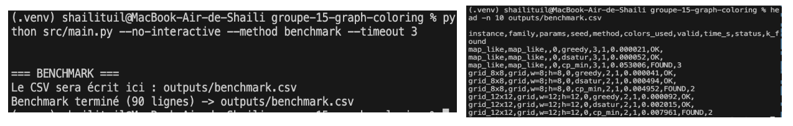 

Cette figure montre le bon fonctionnement du mode benchmark : le programme lance une série de tests sur plusieurs instances et enregistre les résultats dans un fichier CSV. Chaque ligne du fichier contient l’instance testée, la méthode utilisée (greedy, dsatur, cp_min), le nombre de couleurs obtenues, la validité, et le temps d’exécution (et, pour cp_min, la valeur optimale trouvée). Ce format permet ensuite de comparer facilement les méthodes de manière reproductible et d’appuyer l’analyse des performances dans la partie résultats. 

## 2.3 Bonus 3 : Mode “Visualisation “avant / après””
Ici nous avons mis en place la visualisation automatique des graphes, avec deux rendus complémentaires :
Avant (before) : le graphe est affiché sans coloration (couleur unique pour tous les nœuds).
Après (after) : le graphe est affiché avec la coloration trouvée par la méthode choisie (greedy, dsatur, cp_k, cp_min).

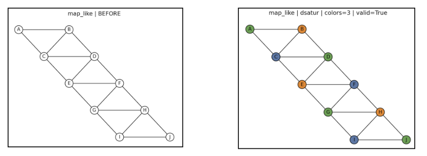 

## 3) Architecture du projet et organisation Git
## 3.1 Organisation générale

Pour respecter les consignes du projet, tout notre travail est regroupé dans un sous-répertoire dédié au groupe : groupe-15-graph-coloring/ 

## 3.2 Rôle des principaux modules
Le projet est construit de manière modulaire afin d’avoir un code plus clair, plus facile à maintenir et plus simple à tester. Chaque fichier a une responsabilité précise :
instances.py : définit les instances de graphes utilisées pour tester le projet. Il centralise la génération et le chargement des graphes, ce qui permet de tester rapidement différentes structures avec les mêmes algorithmes.
solve_coloring.py : contient la partie programmation par contraintes (CP-SAT / OR-Tools) 
heuristiques : greedy / dsatur : ces méthodes fournissent des solutions très rapides, utilisées à la fois comme baseline de comparaison et parfois comme aide pour accélérer la recherche exacte.
viz.py : gère la visualisation des graphes. Il produit les images “before/after” et permet d’enregistrer des figures au format .png pour le rapport et la présentation.
main.py : point d’entrée du programme. Il gère : le choix de l’instance et des paramètres, le choix de la méthode, les options de robustesse et le mode interactif ou non interactif.
benchmark : lance automatiquement une campagne de tests et génère un CSV(outputs/benchmark.csv) avec les résultats.

## 4) Expérimentations et résultats
## 4.1 Instances testées
    Instance map_like
Sur l’instance map_like, cp_min trouve une coloration valide en 3 couleurs. Le solveur montre donc que 2 couleurs sont insuffisantes et que 4 ne sont pas nécessaires. Cela illustre l’écart entre le théorème des quatre couleurs (au plus 4 pour toute carte planaire) et le nombre chromatique d’une carte donnée, ici 3, certifié optimal par l’approche par contraintes.

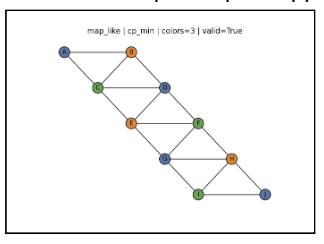

    Instance triangle
L’instance triangle est un graphe complet à 3 nœuds : chaque sommet est adjacent aux deux autres, donc 3 couleurs sont nécessaires. cp_min trouve logiquement une solution en 3 couleurs, confirmant que le nombre chromatique vaut 3. Cette instance sert de test simple pour vérifier que le modèle de contraintes et le solveur fonctionnent correctement.

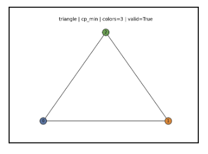

    Instances cycle et influence de la parité
Les cycles illustrent une propriété classique : un cycle pair (ex. cycle_8) est 2-coloriable, et un cycle impair (ex. cycle_9, cycle_25) nécessite 3 couleurs. Cela vient du fait qu’un cycle pair est biparti (coloration alternée possible), alors qu’un cycle impair casse cette alternance. Ces résultats montrent que cp_min retrouve automatiquement ces propriétés théoriques à partir des seules contraintes du modèle.

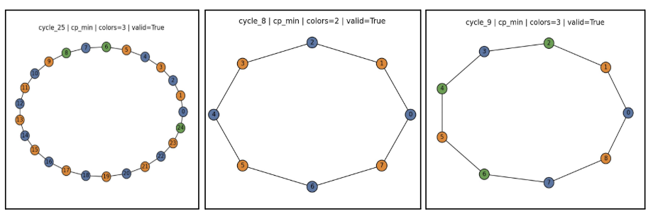

    Instance grid
Nous avons testé cp_min sur plusieurs grilles rectangulaires (ex. 4×4, 6×6) et le solveur trouve à chaque fois une coloration valide en 2 couleurs. Une grille est un graphe biparti : on peut séparer les nœuds en deux ensembles comme sur un échiquier, avec alternance des couleurs. cp_min confirme donc que 2 couleurs suffisent (et qu’1 couleur est impossible), ce qui certifie l’optimalité.

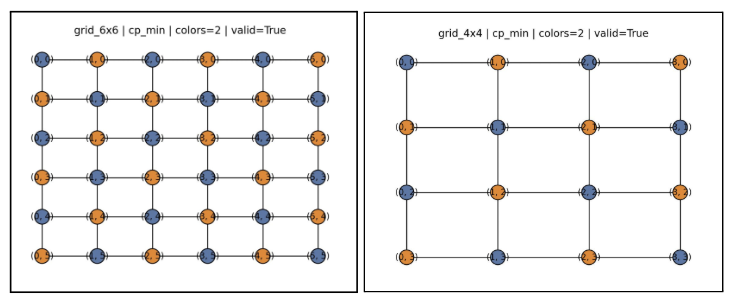 

    Instance erdos
Nous avons aussi testé cp_min sur des graphes aléatoires Erdos, en faisant varier le nombre de sommets n, la probabilité de connexion p et la graine seed. Quand n augmente, le graphe contient plus de contraintes et la recherche du minimum devient plus coûteuse. Le paramètre p contrôle la densité : un p faible produit un graphe clairsemé qui demande souvent peu de couleurs, tandis qu’un p élevé crée beaucoup d’arêtes, donc plus de conflits et généralement plus de couleurs. Par exemple, avec erdos_n15_p0.2, cp_min trouve 3 couleurs, alors qu’avec erdos_n15_p0.8, le besoin monte ici à 8 couleurs.

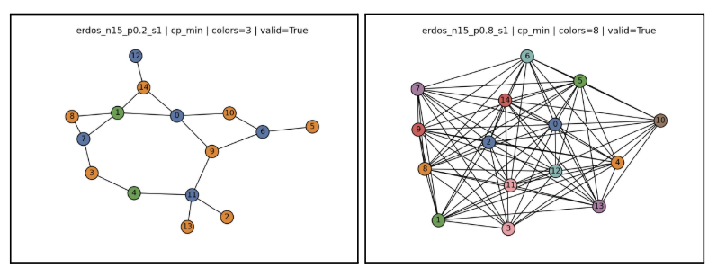

Nous avons aussi testé plusieurs valeurs de seed. À n et p identiques, changer la seed génère un graphe différent, ce qui peut modifier le nombre de couleurs nécessaires. Cela montre que la structure exacte du graphe influence fortement la difficulté du problème

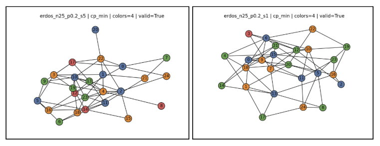

Ces résultats montrent que, pour les graphes aléatoires, la difficulté dépend surtout de la taille du graphe et de sa densité. cp_min trouve bien le nombre minimal de couleurs, mais le temps de calcul augmente lorsque le graphe devient plus grand ou très dense.

## 4.2 Comparaison des méthodes

Nous comparons les méthodes selon trois critères simples et mesurables :
- Validité : une solution est correcte si, pour chaque arête (u,v), on a bien c(u)=c(v). Dans notre programme, cela est vérifié automatiquement via l’indicateur valid=True/False.
- Qualité de solution : mesurée par le nombre de couleurs utilisées (colors_used). Plus ce nombre est faible, meilleure est la solution (surtout si on cherche le minimum).
- Performance : mesurée par le temps d’exécution (time_s). Les heuristiques (Greedy, DSATUR) sont très rapides, tandis que la résolution exacte (cp_min) peut être plus coûteuse mais permet de certifier l’optimalité.

## 5) Conclusion

Dans ce projet, nous avons étudié le problème de la coloration de graphes et de cartes, qui consiste à attribuer une couleur à chaque nœud tout en évitant que deux nœuds adjacents aient la même couleur, en utilisant le moins de couleurs possible. Pour cela, nous avons mis en place plusieurs approches complémentaires, allant d’heuristiques simples à une méthode exacte basée sur la programmation par contraintes.
Les heuristiques mises en œuvre permettent d’obtenir rapidement des colorations valides et de visualiser facilement les graphes, tandis que la programmation par contraintes permet de trouver et de certifier le nombre minimal de couleurs nécessaires. Les résultats obtenus sur différentes instances (cartes, cycles, grilles et graphes aléatoires) sont cohérents avec les propriétés théoriques connues et mettent en évidence l’influence de la structure du graphe sur la difficulté du problème.
Au-delà des algorithmes, ce projet nous a permis de développer un programme clair et complet, intégrant une interface interactive, des visualisations et des exports de résultats. Il nous a également permis de mieux comprendre les compromis entre rapidité, qualité de solution et coût de calcul dans la résolution de problèmes combinatoires.

